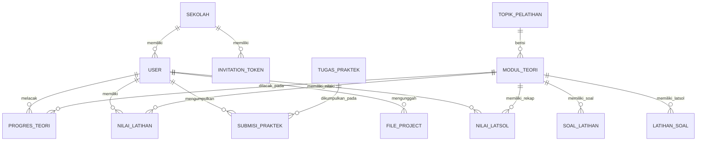

# 📊 Entity Relationship Diagram (ERD) & Skema Database LMS N-KGTS

Dokumen ini berisi diagram relasi antar tabel (ERD) dan penjelasan rinci skema database PostgreSQL yang digunakan pada sistem **LMS N-KGTS (Kaizen Training & Learning Management System)**.

---

## 📐 1. Diagram ERD (Mermaid)

---

## 🗄️ 2. Detail Fungsi Setiap Tabel & Kolom Database

---

### 1. 🏢 **Tabel `sekolah` (Master Data Sekolah Duta)**
* **Fungsi Tabel:** Menyimpan daftar sekolah mitra/duta yang terdaftar dalam ekosistem N-KGTS. Digunakan untuk memfilter siswa, guru, serta analisis statistik per sekolah.

| Nama Kolom | Tipe Data | Key / Constraint | Fungsi & Penjelasan |
| :--- | :--- | :--- | :--- |
| `id` | `Int` | **PK**, Auto Increment | Identifier unik internal untuk setiap sekolah. |
| `nama_sekolah` | `VarChar(150)` | **Unique** | Nama resmi instansi/sekolah. |
| `alamat` | `Text` | Nullable | Alamat fisik sekolah (opsional). |
| `created_at` | `DateTime` | Default `now()` | Waktu saat sekolah pertama kali didaftarkan. |

---

### 2. 👤 **Tabel `users` (Data Pengguna & Akses RBAC)**
* **Fungsi Tabel:** Menyimpan data pengguna platform meliputi 3 peranan (Role-Based Access Control): **Admin**, **Guru**, dan **Siswa**.

| Nama Kolom | Tipe Data | Key / Constraint | Fungsi & Penjelasan |
| :--- | :--- | :--- | :--- |
| `id` | `Uuid` | **PK**, Default UUID | Identifier unik global pengguna (Format UUID). |
| `sekolah_id` | `Int` | **FK** (`sekolah.id`) | Menghubungkan pengguna dengan sekolah asalnya. |
| `nama` | `VarChar(150)` | Not Null | Nama lengkap pengguna. |
| `email` | `VarChar(100)` | **Unique** | Alamat email unik yang digunakan untuk login. |
| `password_hash` | `VarChar(255)` | Not Null | Password login yang dienkripsi aman (Bcrypt/Argon). |
| `role` | `RoleEnum` | `'admin'`, `'guru'`, `'siswa'` | Menentukan level hak akses dalam aplikasi. |
| `nis` | `VarChar(50)` | Nullable | Nomor Induk Siswa (NIS) atau NIP Guru/Admin. |
| `kelas` | `VarChar(20)` | Nullable | Tingkat kelas siswa (misal: "Kelas 10", "Kelas 11"). |
| `no_hp` | `VarChar(20)` | Nullable | Nomor HP/WhatsApp aktif pengguna. |
| `foto_profil` | `Text` | Nullable | URL/Base64 foto profil avatar pengguna. |
| `tempat_lahir` | `VarChar(100)` | Nullable | Kota/tempat kelahiran. |
| `tanggal_lahir` | `Date` | Nullable | Tanggal lahir pengguna. |
| `tahun_pendaftaran`| `Int` | Nullable | Tahun angkatan siswa mendaftar. |
| `created_at` | `DateTime` | Default `now()` | Tanggal pembuatan akun. |
| `updated_at` | `DateTime` | Auto `@updatedAt` | Tanggal terakhir kali akun diperbarui. |

---

### 3. ✉️ **Tabel `invitation_tokens` (Token Undangan Pendaftaran Akun)**
* **Fungsi Tabel:** Digunakan oleh Admin untuk membagikan tautan/token registrasi terverifikasi kepada siswa atau guru baru.

| Nama Kolom | Tipe Data | Key / Constraint | Fungsi & Penjelasan |
| :--- | :--- | :--- | :--- |
| `id` | `Int` | **PK**, Auto Increment | ID unik data undangan. |
| `email` | `VarChar(100)` | Not Null | Email calon pengguna yang diundang. |
| `token` | `VarChar(255)` | **Unique** | Kode token acak unik untuk link registrasi. |
| `role` | `RoleEnum` | `'admin'`, `'guru'`, `'siswa'` | Peran yang akan diberikan saat pendaftaran selesai. |
| `sekolah_id` | `Int` | **FK** (`sekolah.id`) | Sekolah yang ditetapkan untuk pendaftar tersebut. |
| `nama` | `VarChar(150)` | Not Null | Nama calon pendaftar. |
| `nis` | `VarChar(50)` | Nullable | NIS/NIP yang disiapkan oleh admin. |
| `is_used` | `Boolean` | Default `false` | Menandai apakah token undangan sudah pernah dipakai. |
| `expires_at` | `DateTime` | Not Null | Tanggal & waktu kadaluarsa token. |
| `created_at` | `DateTime` | Default `now()` | Tanggal token undangan dibuat. |

---

### 4. ⚙️ **Tabel `settings` (Konfigurasi Sistem Global)**
* **Fungsi Tabel:** Menyimpan pengaturan dinamis aplikasi seperti email kontak support, konfigurasi SMTP, dll.

| Nama Kolom | Tipe Data | Key / Constraint | Fungsi & Penjelasan |
| :--- | :--- | :--- | :--- |
| `id` | `Int` | **PK**, Auto Increment | ID unik pengaturan. |
| `key` | `VarChar(100)` | **Unique** | Kata kunci pengaturan (misal: `"contact_email"`). |
| `value` | `Text` | Not Null | Nilai dari konfigurasi tersebut. |
| `updated_at` | `DateTime` | Auto `@updatedAt` | Waktu konfigurasi terakhir diubah. |

---

### 5. 📂 **Tabel `topik_pelatihan` (Kategori Topik Kaizen)**
* **Fungsi Tabel:** Pengelompokan utama materi (misal: "Budaya Kaizen & Continuous Improvement").

| Nama Kolom | Tipe Data | Key / Constraint | Fungsi & Penjelasan |
| :--- | :--- | :--- | :--- |
| `id` | `Int` | **PK**, Auto Increment | ID unik topik. |
| `nama_topik` | `VarChar(150)` | Not Null | Judul kelompok topik. |
| `deskripsi` | `Text` | Nullable | Penjelasan singkat isi topik. |
| `created_at` | `DateTime` | Default `now()` | Waktu pembuatan topik. |

---

### 6. 📖 **Tabel `modul_teori` (Modul Artikel Pembelajaran)**
* **Fungsi Tabel:** Menyimpan artikel materi pembelajaran Kaizen yang dapat dibaca siswa.

| Nama Kolom | Tipe Data | Key / Constraint | Fungsi & Penjelasan |
| :--- | :--- | :--- | :--- |
| `id` | `Int` | **PK**, Auto Increment | ID unik modul materi. |
| `topik_id` | `Int` | **FK** (`topik_pelatihan.id`) | Relasi ke topik induk. |
| `judul` | `VarChar(255)` | Not Null | Judul modul (misal: "Pengenalan Budaya Kaizen"). |
| `slug` | `VarChar(100)` | **Unique** | URL ramah (*clean URL*) (misal: `"pengenalan-kaizen"`). |
| `deskripsi` | `Text` | Nullable | Konten lengkap artikel dalam format Rich HTML/WYSIWYG. |
| `file_pdf_url` | `VarChar(255)` | Nullable | Link unduhan file slide PPT/PDF asli Supabase. |
| `urutan` | `Int` | Not Null | Nomor urut pembukaan modul (1 s/d 5). |
| `created_at` | `DateTime` | Default `now()` | Tanggal modul dibuat. |

---

### 7. 📊 **Tabel `progres_teori` (Pelacakan Progres Membaca Siswa)**
* **Fungsi Tabel:** Mencatat persentase scroll membaca materi dan status penyelesaian per siswa per modul.

| Nama Kolom | Tipe Data | Key / Constraint | Fungsi & Penjelasan |
| :--- | :--- | :--- | :--- |
| `id` | `Int` | **PK**, Auto Increment | ID unik record progres. |
| `siswa_id` | `Uuid` | **FK** (`users.id`) | Siswa yang bersangkutan. |
| `modul_teori_id` | `Int` | **FK** (`modul_teori.id`) | Modul teori yang dibaca. |
| `status` | `ProgresEnum` | `'belum_dimulai'`, `'sedang_dibaca'`, `'selesai'` | Status keterbacaan materi. |
| `persentase` | `Int` | Default `0` | Angka persentase scroll membaca ($0\% - 100\%$). |
| `updated_at` | `DateTime` | Auto `@updatedAt` | Tanggal terakhir kali progres diperbarui. |

> **Constraint Unique:** `@@unique([siswa_id, modul_teori_id])` memastikan 1 siswa hanya memiliki 1 catatan progres per modul.

---

### 8. 🏆 **Tabel `nilai_latihan` (Skor Kuis Pemahaman Modul)**
* **Fungsi Tabel:** Menyimpan riwayat percobaan pengerjaan kuis pemahaman modul oleh siswa.

| Nama Kolom | Tipe Data | Key / Constraint | Fungsi & Penjelasan |
| :--- | :--- | :--- | :--- |
| `id` | `Int` | **PK**, Auto Increment | ID percobaan kuis. |
| `siswa_id` | `Uuid` | **FK** (`users.id`) | Siswa yang mengerjakan kuis. |
| `modul_teori_id` | `Int` | **FK** (`modul_teori.id`) | Modul kuis yang dikerjakan. |
| `skor` | `Int` | Not Null | Nilai akhir kuis ($0 - 100$). |
| `disubmit_at` | `DateTime` | Default `now()` | Waktu saat kuis dikirimkan. |

---

### 9. ❓ **Tabel `soal_latihan` (Bank Soal Kuis Pemahaman)**
* **Fungsi Tabel:** Menyimpan pertanyaan pilihan ganda (A, B, C, D) untuk kuis tiap modul.

| Nama Kolom | Tipe Data | Key / Constraint | Fungsi & Penjelasan |
| :--- | :--- | :--- | :--- |
| `id` | `Int` | **PK**, Auto Increment | ID unik soal. |
| `modul_teori_id` | `Int` | **FK** (`modul_teori.id`) | Modul pemilik soal ini. |
| `pertanyaan` | `Text` | Not Null | Teks pertanyaan soal kuis. |
| `pilihan_a` | `Text` | Not Null | Teks opsi A. |
| `pilihan_b` | `Text` | Not Null | Teks opsi B. |
| `pilihan_c` | `Text` | Not Null | Teks opsi C. |
| `pilihan_d` | `Text` | Not Null | Teks opsi D. |
| `jawaban_benar` | `Int` | Not Null | Indeks jawaban yang benar (`0` = A, `1` = B, `2` = C, `3` = D). |
| `created_at` | `DateTime` | Default `now()` | Tanggal pembuatan soal. |

---

### 10. 📝 **Tabel `tugas_praktek` (Master Penugasan Praktik Kaizen)**
* **Fungsi Tabel:** Menyimpan judul dan petunjuk penugasan praktik observasi Kaizen di lapangan (Submenu 1 - STOP 6).

| Nama Kolom | Tipe Data | Key / Constraint | Fungsi & Penjelasan |
| :--- | :--- | :--- | :--- |
| `id` | `Int` | **PK**, Auto Increment | ID unik penugasan praktik. |
| `judul` | `VarChar(255)` | Not Null | Judul tugas (misal: "STOP 1 - Identifikasi 5R"). |
| `deskripsi` | `Text` | Not Null | Petunjuk dan arahan pengerjaan tugas. |
| `urutan` | `Int` | Default `1` | Nomor urut penugasan (1 s/d 6). |
| `created_at` | `DateTime` | Default `now()` | Tanggal tugas dibuat. |

---

### 11. 📤 **Tabel `submisi_praktek` (Pengumpulan Tugas Praktik Siswa)**
* **Fungsi Tabel:** Menyimpan hasil observasi lapangan yang dikumpulkan siswa serta nilai/catatan evaluasi dari guru.

| Nama Kolom | Tipe Data | Key / Constraint | Fungsi & Penjelasan |
| :--- | :--- | :--- | :--- |
| `id` | `Uuid` | **PK**, Default UUID | ID unik submisi tugas. |
| `tugas_praktek_id` | `Int` | **FK** (`tugas_praktek.id`) | Tugas yang dikumpulkan. |
| `siswa_id` | `Uuid` | **FK** (`users.id`) | Siswa pengumpul tugas. |
| `tanggal` | `VarChar(10)` | Not Null | Tanggal pengisian (Format: `YYYY-MM-DD`). |
| `area_pengisian` | `Text` | Not Null | Teks lokasi/area observasi lapangan. |
| `keterangan` | `Text` | Nullable | Penjelasan rinci hasil observasi atau link foto bukti. |
| `detail_jawaban` | `Json` | Nullable | Data masukan variabel dinamis (opsional). |
| `nilai` | `Int` | Nullable | Nilai evaluasi dari guru ($0 - 100$). |
| `catatan_guru` | `Text` | Nullable | Ulasan/catatan perbaikan dari guru. |
| `submitted_at` | `DateTime` | Default `now()` | Waktu saat tugas pertama kali dikirim. |
| `updated_at` | `DateTime` | Auto `@updatedAt` | Waktu saat tugas atau nilai diperbarui. |

> **Constraint Unique:** `@@unique([siswa_id, tugas_praktek_id])` memastikan 1 siswa hanya dapat mengumpulkan 1 laporan per topik praktik.

---

### 12. 📁 **Tabel `file_project` (Pengumpulan Proposal & Laporan Akhir)**
* **Fungsi Tabel:** Menyimpan berkas proyek kelompok (Proposal & Laporan Akhir Kaizen) yang diunggah siswa beserta berkas revisi dan penilaian dari guru.

| Nama Kolom | Tipe Data | Key / Constraint | Fungsi & Penjelasan |
| :--- | :--- | :--- | :--- |
| `id` | `Uuid` | **PK**, Default UUID | ID unik berkas proyek. |
| `siswa_id` | `Uuid` | **FK** (`users.id`) | Siswa perwakilan kelompok yang mengunggah. |
| `tipe` | `VarChar(50)` | Not Null | Jenis pengumpulan (`"proposal"` atau `"laporan"`). |
| `file_url` | `Text` | Not Null | URL/Data file proposal atau laporan siswa. |
| `file_name` | `VarChar(255)` | Not Null | Nama file asli (misal: `"Proposal_Kaizen_Kelompok1.pdf"`). |
| `catatan_siswa` | `Text` | Nullable | Catatan pengantar dari siswa untuk guru. |
| `file_revisi_url` | `Text` | Nullable | File coretan/revisi balik yang diunggah oleh Guru. |
| `file_revisi_name` | `VarChar(255)` | Nullable | Nama file revisi dari guru. |
| `catatan_guru` | `Text` | Nullable | Masukan dan bimbingan revisi dari guru. |
| `nilai` | `Int` | Nullable | Nilai proyek akhir dari guru ($0 - 100$). |
| `submitted_at` | `DateTime` | Default `now()` | Tanggal unggah berkas. |
| `updated_at` | `DateTime` | Auto `@updatedAt` | Tanggal update terakhir. |

---

### 13. 🎯 **Tabel `latihan_soal` & `nilai_latsol` (Bank Soal Dinamis)**

#### **Tabel `latihan_soal`**
| Nama Kolom | Tipe Data | Key / Constraint | Fungsi & Penjelasan |
| :--- | :--- | :--- | :--- |
| `id` | `Int` | **PK**, Auto Increment | ID unik latihan soal. |
| `modul_teori_id` | `Int` | **FK** (`modul_teori.id`) | Modul pemilik soal. |
| `pertanyaan` | `Text` | Not Null | Pertanyaan latihan. |
| `pilihan` | `Json` | Not Null | Array JSON pilihan jawaban (`["Opsi A", "Opsi B", ...]`). |
| `jawaban_benar` | `Int` | Not Null | Indeks jawaban benar pada array JSON. |
| `poin` | `Int` | Default `10` | Poin nilai jika menjawab benar. |
| `image_url` | `Text` | Nullable | URL gambar ilustrasi soal (jika ada). |

#### **Tabel `nilai_latsol`**
| Nama Kolom | Tipe Data | Key / Constraint | Fungsi & Penjelasan |
| :--- | :--- | :--- | :--- |
| `id` | `Int` | **PK**, Auto Increment | ID rekap nilai. |
| `siswa_id` | `Uuid` | **FK** (`users.id`) | Siswa yang mengerjakan. |
| `modul_teori_id` | `Int` | **FK** (`modul_teori.id`) | Modul teori terkait. |
| `skor` | `Int` | Not Null | Persentase skor ($0 - 100$). |
| `total_poin` | `Int` | Not Null | Total akumulasi poin yang diperoleh. |
| `disubmit_at` | `DateTime` | Default `now()` | Waktu selesai pengerjaan. |

---

### 🔑 **Enum Data Types**
1. **`RoleEnum`**:
   - `admin`: Memiliki hak penuh (mengelola user, sekolah, topik, materi, soal, dan memantau seluruh proyek).
   - `guru`: Memperoleh akses penilaian tugas praktik, merevisi file proyek siswa, dan melihat perkembangan siswa.
   - `siswa`: Mengakses materi pembelajaran, mengerjakan kuis, mengumpulkan tugas praktik, dan mengunggah proyek kelompok.

2. **`ProgresEnum`**:
   - `belum_dimulai`: Siswa belum pernah membuka modul.
   - `sedang_dibaca`: Siswa sedang membaca materi ($1\% - 99\%$).
   - `selesai`: Siswa telah membaca $100\%$ materi atau lulus kuis modul ($\ge 70$).
