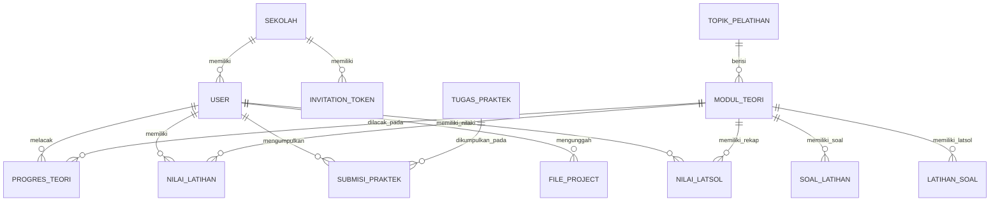

# 📊 Entity Relationship Diagram (ERD) & Skema Database LMS N-KGTS

Dokumen ini berisi diagram relasi antar tabel (ERD) dan penjelasan rinci skema database PostgreSQL yang digunakan pada sistem **LMS N-KGTS (Kaizen Training & Learning Management System)**.

---

## 📐 1. Diagram ERD (Mermaid)

---

## 🗄️ 2. Detail Spesifikasi Tabel Database

### 🏢 **a. Tabel `sekolah` (Master Data Sekolah Duta)**
Menyimpan data master sekolah yang terdaftar di dalam program N-KGTS.

| Field Name | Type | Key / Constraint | Description |
| :--- | :--- | :--- | :--- |
| `id` | `Int` | **PK**, Auto Increment | ID unik sekolah |
| `nama_sekolah` | `VarChar(150)` | **Unique** | Nama resmi sekolah |
| `alamat` | `Text` | Nullable | Alamat lengkap sekolah |
| `created_at` | `DateTime` | Default `now()` | Waktu pembuatan record |

---

### 👤 **b. Tabel `users` (Data Pengguna & RBAC)**
Menyimpan kredensial dan atribut profil untuk **Admin**, **Guru**, dan **Siswa**.

| Field Name | Type | Key / Constraint | Description |
| :--- | :--- | :--- | :--- |
| `id` | `Uuid` | **PK**, Default UUID | Unique User ID |
| `sekolah_id` | `Int` | **FK** (`sekolah.id`) | Relasi sekolah asal user |
| `nama` | `VarChar(150)` | Not Null | Nama lengkap pengguna |
| `email` | `VarChar(100)` | **Unique** | Email login pengguna |
| `password_hash` | `VarChar(255)` | Not Null | Hash password terenkripsi |
| `role` | `RoleEnum` | Enum: `admin`, `guru`, `siswa` | Hak akses pengguna |
| `nis` | `VarChar(50)` | Nullable | Nomor Induk Siswa / NIP |
| `kelas` | `VarChar(20)` | Nullable | Kelas siswa (misal: "Kelas 10") |
| `no_hp` | `VarChar(20)` | Nullable | Nomor telepon |
| `foto_profil` | `Text` | Nullable | URL foto profil |
| `created_at` | `DateTime` | Default `now()` | Tanggal pendaftaran |

---

### 📚 **c. Tabel `topik_pelatihan` & `modul_teori`**
Menyimpan struktur modul teori Kaizen.

#### **Tabel `topik_pelatihan`**
| Field Name | Type | Key / Constraint | Description |
| :--- | :--- | :--- | :--- |
| `id` | `Int` | **PK**, Auto Increment | ID topik |
| `nama_topik` | `VarChar(150)` | Not Null | Nama topik Kaizen |
| `deskripsi` | `Text` | Nullable | Penjelasan topik |

#### **Tabel `modul_teori`**
| Field Name | Type | Key / Constraint | Description |
| :--- | :--- | :--- | :--- |
| `id` | `Int` | **PK**, Auto Increment | ID modul teori |
| `topik_id` | `Int` | **FK** (`topik_pelatihan.id`) | Topik induk |
| `judul` | `VarChar(255)` | Not Null | Judul materi |
| `slug` | `VarChar(100)` | **Unique** | Slug URL unik |
| `deskripsi` | `Text` | Nullable | Konten Rich-HTML artikel |
| `file_pdf_url` | `VarChar(255)` | Nullable | Link PPT/PDF asli Supabase |
| `urutan` | `Int` | Not Null | Urutan modul (1-5) |

---

### 📈 **d. Tabel `progres_teori` & `nilai_latihan`**

#### **Tabel `progres_teori` (Pelacakan Scroll & Status Selesai)**
| Field Name | Type | Key / Constraint | Description |
| :--- | :--- | :--- | :--- |
| `id` | `Int` | **PK**, Auto Increment | ID record progres |
| `siswa_id` | `Uuid` | **FK** (`users.id`) | ID siswa |
| `modul_teori_id` | `Int` | **FK** (`modul_teori.id`) | ID modul teori |
| `status` | `ProgresEnum` | Enum: `belum_dimulai`, `sedang_dibaca`, `selesai` | Status kelulusan |
| `persentase` | `Int` | Default `0` | Persentase baca real-time ($0-100\%$) |

#### **Tabel `nilai_latihan` (Skor Kuis Pemahaman Modul)**
| Field Name | Type | Key / Constraint | Description |
| :--- | :--- | :--- | :--- |
| `id` | `Int` | **PK**, Auto Increment | ID percobaan kuis |
| `siswa_id` | `Uuid` | **FK** (`users.id`) | ID siswa |
| `modul_teori_id` | `Int` | **FK** (`modul_teori.id`) | ID modul teori |
| `skor` | `Int` | Not Null | Skor kuis ($0-100$) |
| `disubmit_at` | `DateTime` | Default `now()` | Waktu pengiriman kuis |

---

### 🛠️ **e. Tabel `tugas_praktek` & `submisi_praktek` (Penugasan Praktik)**

#### **Tabel `tugas_praktek`**
| Field Name | Type | Key / Constraint | Description |
| :--- | :--- | :--- | :--- |
| `id` | `Int` | **PK**, Auto Increment | ID topik penugasan |
| `judul` | `VarChar(255)` | Not Null | Judul penugasan praktik |
| `deskripsi` | `Text` | Not Null | Instruksi pengerjaan |
| `urutan` | `Int` | Default `1` | Urutan tugas (1-6) |

#### **Tabel `submisi_praktek`**
| Field Name | Type | Key / Constraint | Description |
| :--- | :--- | :--- | :--- |
| `id` | `Uuid` | **PK**, Default UUID | ID submisi tugas |
| `tugas_praktek_id` | `Int` | **FK** (`tugas_praktek.id`) | ID tugas |
| `siswa_id` | `Uuid` | **FK** (`users.id`) | ID siswa pengumpul |
| `area_pengisian` | `Text` | Not Null | Area observasi/jawaban |
| `nilai` | `Int` | Nullable | Nilai evaluasi dari guru ($0-100$) |
| `catatan_guru` | `Text` | Nullable | Feedback & masukan guru |
| `submitted_at` | `DateTime` | Default `now()` | Waktu pengumpulan |

---

### 📁 **f. Tabel `file_project` (Pengumpulan Proposal & Laporan Kaizen)**

| Field Name | Type | Key / Constraint | Description |
| :--- | :--- | :--- | :--- |
| `id` | `Uuid` | **PK**, Default UUID | ID file project |
| `siswa_id` | `Uuid` | **FK** (`users.id`) | ID siswa pengunggah |
| `tipe` | `VarChar(50)` | `"proposal"` / `"laporan"` | Tipe berkas |
| `file_url` | `Text` | Not Null | File data / URL Supabase |
| `file_name` | `VarChar(255)` | Not Null | Nama berkas asli |
| `catatan_siswa` | `Text` | Nullable | Catatan/pengantar siswa |
| `file_revisi_url` | `Text` | Nullable | Berkas koreksi balik dari Guru |
| `nilai` | `Int` | Nullable | Nilai proyek kelompok ($0-100$) |
| `catatan_guru` | `Text` | Nullable | Feedback evaluasi guru |
| `submitted_at` | `DateTime` | Default `now()` | Tanggal pengumpulan |

---

### 🔑 **g. Enum Data Types**
1. **`RoleEnum`**: `'admin'`, `'guru'`, `'siswa'`
2. **`ProgresEnum`**: `'belum_dimulai'`, `'sedang_dibaca'`, `'selesai'`
